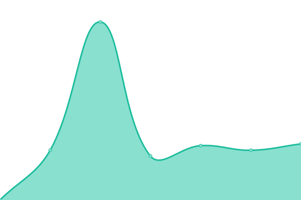

# [📈 Live Status](https://nathan026.github.io/Upptime): <!--live status--> **🟧 Partial outage**

This repository contains the open-source uptime monitor and status page for [nathan026](https://nathan026.github.io/Upptime), powered by [Upptime](https://github.com/upptime/upptime).

With [Upptime](https://upptime.js.org), you can get your own unlimited and free uptime monitor and status page, powered entirely by a GitHub repository. We use [Issues](https://github.com/nathan026/Upptime/issues) as incident reports, [Actions](https://github.com/nathan026/Upptime/actions) as uptime monitors, and [Pages](https://nathan026.github.io/Upptime) for the status page.

<!--start: status pages-->
<!-- This summary is generated by Upptime (https://github.com/upptime/upptime) -->
<!-- Do not edit this manually, your changes will be overwritten -->
<!-- prettier-ignore -->
| URL | Status | History | Response Time | Uptime |
| --- | ------ | ------- | ------------- | ------ |
|  [ezimanager.gapsolutions.com.au](https://ezimanager.gapsolutions.com.au) | 🟩 Up | [ezimanager-gapsolutions-com-au.yml](https://github.com/nathan026/Upptime/commits/HEAD/history/ezimanager-gapsolutions-com-au.yml) | 

 1052ms
     
 | 

<a href="https://nathan026.github.io/Upptime/history/ezimanager-gapsolutions-com-au">100.00%</a>
    

|  [login.ezimanager.cloud](https://login.ezimanager.cloud/api/speed) | 🟥 Down | [login-ezimanager-cloud.yml](https://github.com/nathan026/Upptime/commits/HEAD/history/login-ezimanager-cloud.yml) | 

 835ms
     
 | 

<a href="https://nathan026.github.io/Upptime/history/login-ezimanager-cloud">100.00%</a>
    

|  [express.ezimanager.cloud](https://express.ezimanager.cloud) | 🟩 Up | [express-ezimanager-cloud.yml](https://github.com/nathan026/Upptime/commits/HEAD/history/express-ezimanager-cloud.yml) | 

 1082ms
     
 | 

<a href="https://nathan026.github.io/Upptime/history/express-ezimanager-cloud">100.00%</a>
    

|  [gap4.ezimanager.cloud](https://gap4.ezimanager.cloud) | 🟩 Up | [gap4-ezimanager-cloud.yml](https://github.com/nathan026/Upptime/commits/HEAD/history/gap4-ezimanager-cloud.yml) | 

 1006ms
     
 | 

<a href="https://nathan026.github.io/Upptime/history/gap4-ezimanager-cloud">100.00%</a>
    

|  [metcash.gapsolutions.com.au](https://metcash.ezimanager.cloud) | 🟩 Up | [metcash-gapsolutions-com-au.yml](https://github.com/nathan026/Upptime/commits/HEAD/history/metcash-gapsolutions-com-au.yml) | 

 1002ms
     
 | 

<a href="https://nathan026.github.io/Upptime/history/metcash-gapsolutions-com-au">100.00%</a>
    

|  [au2.ezimanager.cloud](https://au2.ezimanager.cloud/api/speed) | 🟥 Down | [au2-ezimanager-cloud.yml](https://github.com/nathan026/Upptime/commits/HEAD/history/au2-ezimanager-cloud.yml) | 

 868ms
     
 | 

<a href="https://nathan026.github.io/Upptime/history/au2-ezimanager-cloud">100.00%</a>
    

|  [au3.ezimanager.cloud](https://au3.ezimanager.cloud) | 🟩 Up | [au3-ezimanager-cloud.yml](https://github.com/nathan026/Upptime/commits/HEAD/history/au3-ezimanager-cloud.yml) | 

 1222ms
     
 | 

<a href="https://nathan026.github.io/Upptime/history/au3-ezimanager-cloud">100.00%</a>
    

|  [ezi-rewards.net](https://ezirewards.net/) | 🟥 Down | [ezi-rewards-net.yml](https://github.com/nathan026/Upptime/commits/HEAD/history/ezi-rewards-net.yml) | 

 0ms
     
 | 

<a href="https://nathan026.github.io/Upptime/history/ezi-rewards-net">100.00%</a>
    

<!--end: status pages-->

[**Visit our status website →**](https://nathan026.github.io/Upptime)

## 📄 License

- Powered by: [Upptime](https://github.com/upptime/upptime)
- Code: [MIT](./LICENSE) © [nathan026](https://nathan026.github.io/Upptime)
- Data in the `./history` directory: [Open Database License](https://opendatacommons.org/licenses/odbl/1-0/)
